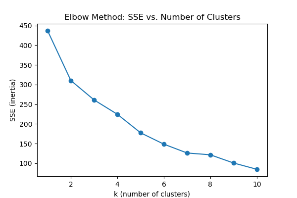
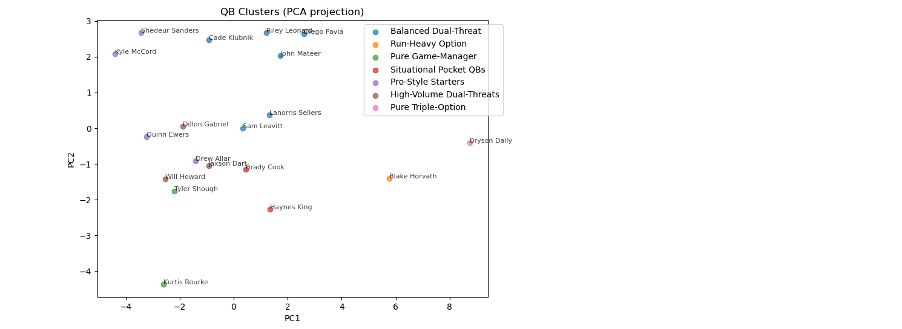

# College Football QB Fit Recommender

## Overview
This project profiles college football quarterbacks and clusters them into archetypes based on statistical, efficiency, and scheme-based features. The ultimate goal is to recommend college programs that fit a quarterback's style and strengths.

## Data Sources
- **CollegeFootballData API**: Box-score statistics, usage splits, PPA metrics.
- **Recruiting profiles**: Height, weight, position, hometown, and team colors.
- **CSV of Top QB Profiles**: Pre-collected aggregated stats for the top 50 quarterbacks (`top50_qb_profiles.csv`).

## Feature Engineering
Key features used for clustering:
- **Passing**: Attempts, completions, completion %, yards, yards per attempt, TDs, INTs.
- **Rushing**: Carries, yards, yards per carry, TDs, long runs.
- **Usage**: Overall snap share, pass-snap %, rush-snap %.
- **Efficiency**: Average PPA (all, pass, rush) and derived success/explosiveness rates.
- **Context**: Normalized metrics (`pct_team_pass_snaps`, `pct_team_run_snaps`, `share_team_pass_snaps`).

## Clustering Analysis

### Elbow Method


The elbow plot suggests **k = 7** clusters captures diversity in QB styles without overfitting.

### PCA Projection


The PCA projection visualizes the seven clusters in 2D space, annotated with QB names and cluster labels.

## Cluster Archetypes
| Cluster Label                | Size | Description                                                      |
|------------------------------|------|------------------------------------------------------------------|
| Pure Triple-Option           | 1    | Service-academy runners with extreme run-heavy profiles.         |
| Run-Heavy Option             | 1    | Navy-style run-first dual-threats.                               |
| Pure Game-Manager            | 2    | Pocket passers focused on managing the game with minimal runs.   |
| Situational Pocket QBs       | 2    | Low-volume QBs used in specific packages.                        |
| Pro-Style Starters           | 4    | High-volume, pro-style passers with balanced efficiency.         |
| High-Volume Dual-Threats     | 3    | QBs with significant rushing and passing output.                 |
| Balanced Dual-Threat         | 6    | QBs with a balanced mix of pass and run contributions.           |

### Cross-Tab with Manual Prototypes
| Cluster Label            | Dual Threat | Game Manager | Pocket Passer |
|--------------------------|-------------|--------------|---------------|
| Pure Triple-Option       | 1.00        | 0.00         | 0.00          |
| Run-Heavy Option         | 1.00        | 0.00         | 0.00          |
| Pure Game-Manager        | 0.00        | 1.00         | 0.00          |
| Situational Pocket QBs   | 0.50        | 0.50         | 0.00          |
| Pro-Style Starters       | 0.25        | 0.50         | 0.25          |
| High-Volume Dual-Threats | 0.67        | 0.33         | 0.00          |
| Balanced Dual-Threat     | 1.00        | 0.00         | 0.00          |

## Next Steps
1. **Program Clustering**: Cluster college programs by scheme to match QB archetypes.
2. **Recommender System**: Build a similarity-based recommendation engine pairing QBs with fitting programs.
3. **Model Evaluation**: Validate recommendations against historical recruitment data.
4. **Feature Expansion**: Incorporate athletic testing, PFF film grades, and intangibles.

## Usage
```bash
# Generate QB profiles CSV
python player_data.py --batch

# Run clustering analysis and view results
python qb_analysis.py
```

## License
MIT License
